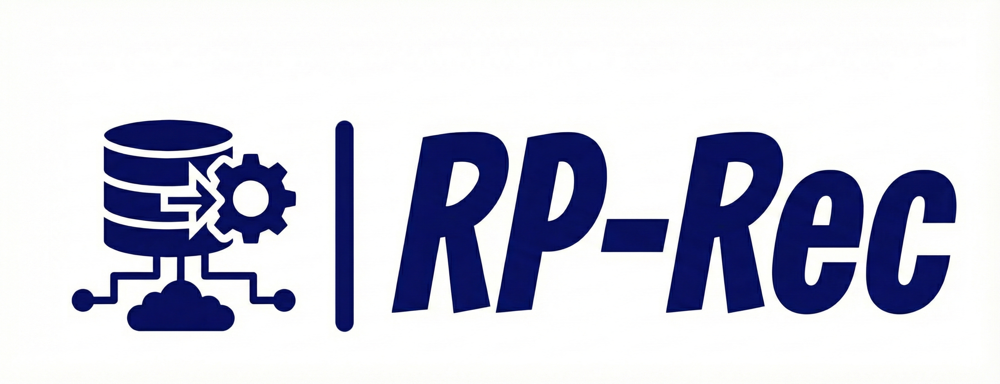
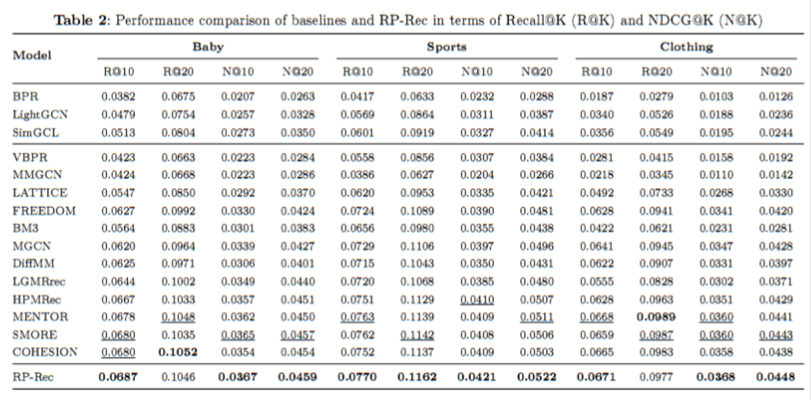

# A Rectification-Purification Framework for More Effective Multimodal Recommendation

<!-- PROJECT LOGO -->
<br />
<div align="center">
    
  </a>
</div>

## Introduction

This is the Pytorch implementation for our  paper:

> 


## Enviroment Requirement
- python 3.8
- Pytorch 1.12

## Dataset

We provide three processed datasets: Baby, Sports and Clothing.


## Training
  ```
  cd ./src
  python main.py
  ```
## Performance Comparison



## Acknowledgement
The structure of this code is  based on [MMRec](https://github.com/enoche/MMRec). Thank for their work.
